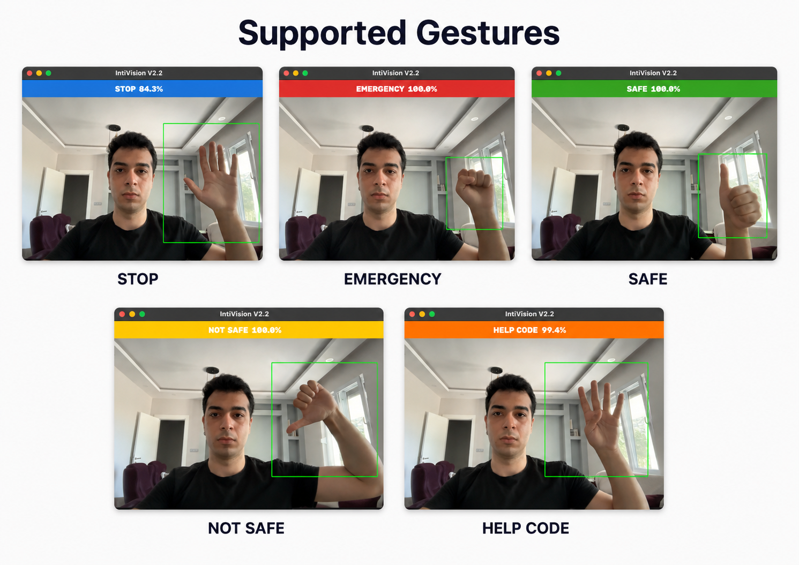
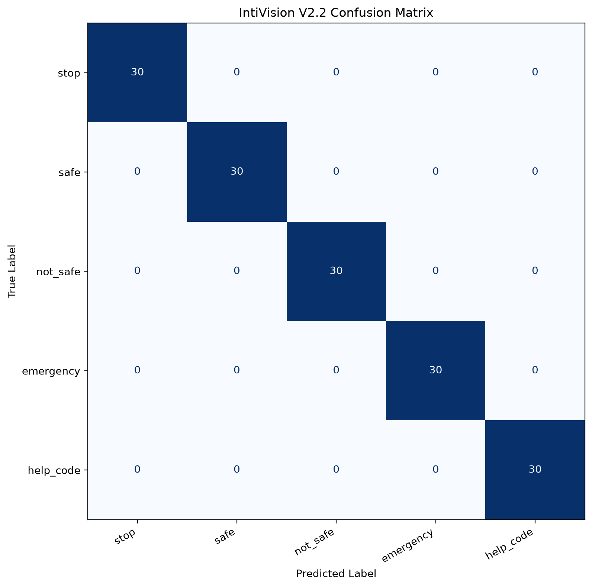
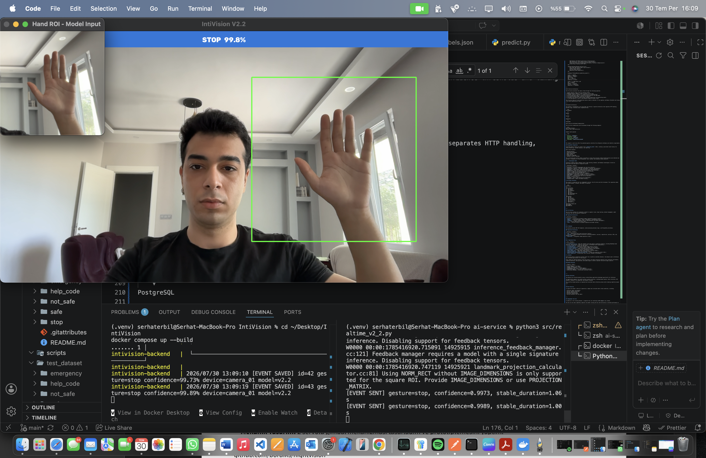
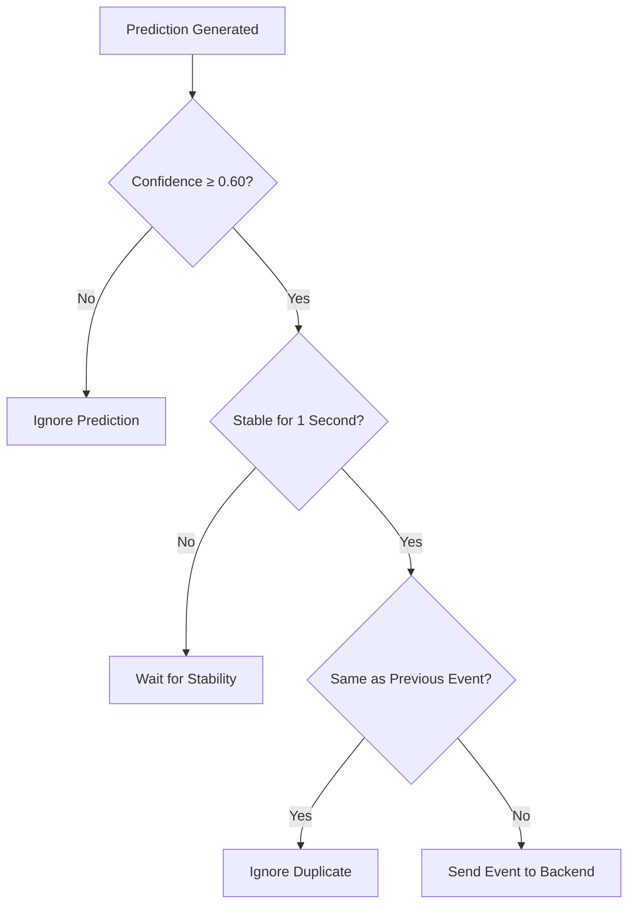
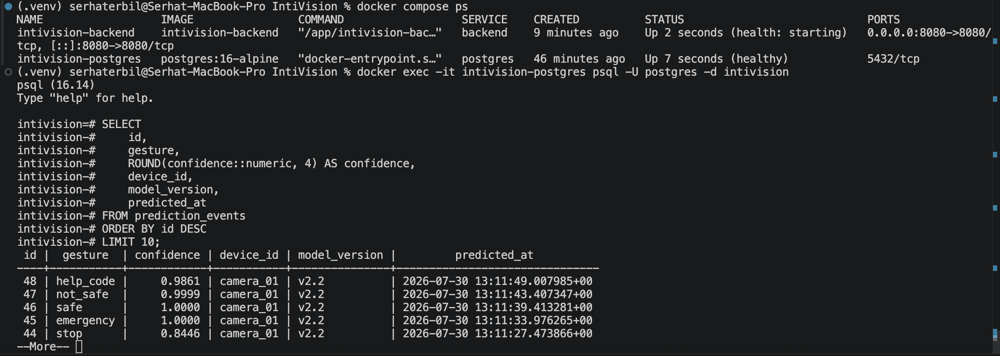

# 🤖 IntiVision

> An AI-powered workplace safety system that enables factory workers to communicate safety conditions and emergency signals through real-time hand gesture recognition, powered by Computer Vision, Deep Learning, MediaPipe and Go backend services.


---

## 🎥 Demo

The following video demonstrates the complete IntiVision pipeline, including real-time hand detection, gesture classification, prediction stability, backend communication, and PostgreSQL event storage.

[▶️ Watch the IntiVision Demo](docs/media/intivision_demo.mp4)

---

# 📚 Table of Contents

- [Problem Statement](#problem-statement)
- [Supported Gestures](#-supported-gestures)
- [Technical Architecture](#-technical-architecture)
- [Technologies Used](#-technologies-used)
- [Project Structure](#-project-structure)
- [Dataset](#-dataset)
- [Data Preprocessing](#-data-preprocessing)
- [CNN Model Architecture](#-cnn-model-architecture)
- [Model Development Journey](#-model-development-journey)
- [Model Results](#-model-results)
- [Real-Time Inference](#-real-time-inference)
- [Backend Service](#-backend-service)
- [Backend API](#-backend-api)
- [Database](#-database)
- [System Requirements](#-system-requirements)
- [AI Service Setup](#-ai-service-setup)
- [Backend and Database Setup](#-backend-and-database-setup)
- [Running the Project](#-running-the-project)
- [Challenges and Solutions](#-challenges-and-solutions)
- [Project Limitations](#-project-limitations)
- [License](#-license)
- [Developer](#-developer)
- [Project Status](#-project-status)

# Problem Statement

In emergency situations, verbal communication may not always be possible. Individuals who are injured, trapped, unable to speak, or have hearing and speech impairments often need alternative ways to communicate critical information quickly and effectively.

Traditional emergency reporting methods generally rely on voice communication or manual interaction with mobile devices, which may not always be practical during high-stress situations.

IntiVision addresses this challenge by recognizing predefined hand gestures in real time using computer vision and deep learning. The system translates these gestures into digital events that can be processed, stored, or integrated with external emergency response systems.

The project demonstrates how AI-powered gesture recognition can improve accessibility, safety, and human-computer interaction in scenarios where traditional communication methods are limited.

## Why Hand Gestures?

Hand gestures provide a fast, intuitive, and language-independent communication method. Unlike voice-based systems, gesture recognition can operate silently and remains effective even when speech is not possible.

This makes gesture recognition particularly suitable for emergency communication, accessibility solutions, and future smart environment applications.

## Target Use Cases

- Workplace safety communication in factories and industrial environments
- Emergency assistance requests
- Silent communication in critical situations
- Recording and tracking safety alerts for incident analysis and reporting
- Accessibility support for individuals with speech or hearing impairments
- AI-based smart surveillance and monitoring systems
- Human-computer interaction research

## Project Goal

The primary goal of IntiVision is not to replace existing emergency communication systems, but to demonstrate an extensible AI-based architecture capable of recognizing critical safety and emergency hand gestures in real time.

By combining Computer Vision, Deep Learning, MediaPipe, and a Go backend, the project provides an end-to-end pipeline from camera input and hand gesture recognition to backend event generation and PostgreSQL storage. This architecture creates a foundation for future intelligent workplace safety, emergency communication, and accessibility applications.

# ✋ Supported Gestures

IntiVision currently recognizes five predefined hand gestures. Each gesture represents a specific state or emergency-related action and can trigger a corresponding event in the backend system.

| Gesture | Description |
|---------|-------------|
| **🟢 safe** | Indicates that the person is safe and no emergency assistance is required. |
| **🟡 not_safe** | Indicates that the person feels unsafe or is in a potentially dangerous situation. |
| **✋ stop** | Represents a stop command or requests the current action to be halted. |
| **🔴 emergency** | Indicates an emergency situation requiring immediate attention. |
| **🆘 help_code** | Represents a predefined silent request for help using a specific hand gesture. |

---

## 📸 Gesture Examples

The following image presents the five hand gestures currently supported by IntiVision.



# 🏗️ Technical Architecture

IntiVision follows a service-oriented architecture composed of two main applications: a Python-based AI service and a Go-based backend service.

The AI service processes camera input, classifies supported gestures, validates predictions, and generates backend events.

Once a gesture is confirmed, the AI service sends a structured event to the backend through a REST API.

The Go backend receives the event, processes it through a layered architecture, and stores the gesture, confidence score, device ID, model version, and timestamp in PostgreSQL.

## Architecture Flow

```mermaid
flowchart LR
    Camera["📷 Camera Input"]

    subgraph AI["AI Service · Python"]
        OpenCV["OpenCV<br/>Frame Capture"]
        MediaPipe["MediaPipe<br/>Hand Detection"]
        ROI["Dynamic Hand ROI<br/>Extraction & Preprocessing"]
        CNN["TensorFlow / Keras CNN<br/>Gesture Classification"]
        Stability["Prediction Validation<br/>Confidence, Duration & Deduplication"]
        Client["Event Client<br/>HTTP POST"]
    end

    subgraph Backend["Backend Service · Go"]
        API["Fiber REST API<br/>POST /api/v1/events"]
        Handler["Event Handler"]
        Service["Event Service"]
        Repository["Event Repository"]
    end

    Database[("PostgreSQL<br/>prediction_events")]

    Camera --> OpenCV
    OpenCV --> MediaPipe
    MediaPipe --> ROI
    ROI --> CNN
    CNN --> Stability
    Stability --> Client

    Client -->|"JSON Event"| API
    API --> Handler
    Handler --> Service
    Service --> Repository
    Repository --> Database
```


---

## AI Service Architecture

The AI service processes the camera stream through the following pipeline:

1. OpenCV captures frames from the connected camera.
2. MediaPipe detects whether a hand is present in the frame.
3. A dynamic region of interest is created around the detected hand.
4. The extracted hand image is resized and preprocessed for the CNN model.
5. The TensorFlow/Keras model classifies the gesture.
6. Confidence and stability checks prevent unstable predictions from generating events.
7. A confirmed gesture is sent to the backend through the event client.

The AI service does not send predictions when no hand is detected. It also applies confidence thresholds and timing rules before generating an event.

---

## Backend Architecture

The backend is implemented in Go using Fiber and follows a layered architecture that separates HTTP handling, business logic, and data access responsibilities.

```text
HTTP Request
    │
    ▼
Handler
    │
    ▼
Service
    │
    ▼
Repository
    │
    ▼
PostgreSQL
```

## AI Service and Backend Communication

After a gesture satisfies the configured confidence and stability requirements, the AI service sends it to the Go backend through the `POST /api/v1/events` endpoint.

The complete request and response examples are documented in the Backend API section.

## PostgreSQL Integration

Confirmed gesture events are stored in the `prediction_events` table, creating a persistent event history for safety monitoring, incident analysis, and reporting.

This structured event history makes it possible to review when and where safety-related gestures were detected and provides a foundation for future dashboards, alert systems, and workplace safety analytics.


# 🛠️ Technologies Used

IntiVision combines modern Computer Vision, Deep Learning, Backend, and Database technologies to build an end-to-end real-time gesture recognition system.

| Technology | Purpose |
|------------|---------|
| **Python** | AI service development and real-time inference |
| **TensorFlow / Keras** | CNN model development, training, and inference |
| **OpenCV** | Camera access, image processing, and frame manipulation |
| **MediaPipe** | Real-time hand detection and dynamic ROI extraction |
| **NumPy** | Numerical operations and image preprocessing |
| **Go** | Backend service implementation |
| **Fiber** | High-performance REST API framework |
| **PostgreSQL** | Persistent storage of prediction events |
| **REST API** | Communication between AI service and backend |
| **Docker** | Containerization and service deployment |
| **Git** | Version control |
| **GitHub** | Source code hosting and collaboration |
| **Hugging Face** | Model and dataset hosting |

# 📂 Project Structure

The project is organized into two independent services: the AI service and the Go backend. This separation makes the system modular, extensible, and easier to maintain.

```text
IntiVision/
│
├── ai-service/
│   ├── assets/
│   │   └── sounds/
│   ├── dataset/
│   ├── dataset_mediapipe/
│   ├── models/
│   ├── notebooks/
│   ├── src/
│   ├── tools/
│   └── requirements.txt
│
├── backend/
│   ├── cmd/
│   ├── internal/
│   ├── migrations/
│   ├── .env.example
│   ├── Dockerfile
│   ├── go.mod
│   └── go.sum
│
├── deployments/
│
├── docs/
│   └── media/
│       ├── confusion_matrix_v2_2.png
│       ├── intivision_demo.mp4
│       ├── postgresql_events.png
│       ├── realtime_inference.png
│       └── supported_gestures.png
│
├── IntiVision-Dataset/
│
├── scripts/
│
├── test_dataset/
│
├── docker-compose.yml
├── LICENSE
└── README.md
```

---

## 📁 AI Service

The AI service contains all components related to computer vision, deep learning, dataset management, model training, and real-time gesture recognition.

### Important Directories

| Directory | Purpose |
|-----------|---------|
| `dataset/` | Raw gesture images collected for model development |
| `dataset_mediapipe/` | MediaPipe-processed images used for V2.2 model training |
| `models/` | Trained CNN models, labels, checkpoints, and MediaPipe assets |
| `notebooks/` | Jupyter notebooks used for experimentation and model development |
| `src/` | Core AI application source code |
| `tools/` | Utility scripts for dataset inspection and model testing |

---

## 📁 Backend

The backend provides REST API endpoints, event-processing business logic, and PostgreSQL persistence.

### Important Directories

| Directory | Purpose |
|-----------|---------|
| `cmd/` | Application entry point and server startup |
| `internal/` | Layered backend architecture containing handlers, services, repositories, entities, DTOs, and database components |
| `migrations/` | PostgreSQL schema migration scripts |

---

## 📁 Supporting Directories

| Directory | Purpose |
|-----------|---------|
| `ai-service/assets/` | Audio and other runtime assets used by the AI service |
| `deployments/` | Deployment-related configuration and resources |
| `docs/media/` | README images, screenshots, evaluation visuals, and demo video |
| `IntiVision-Dataset/` | Dataset-related repository files and documentation |
| `scripts/` | Project-level utility and automation scripts |
| `test_dataset/` | Independent images reserved for model evaluation |

---

## 📄 Important Files

| File | Purpose |
|------|---------|
| `ai-service/src/realtime_v2_2.py` | Runs the complete real-time gesture recognition pipeline, including MediaPipe hand detection, CNN inference, stability verification, and backend event communication. |
| `ai-service/src/train_model.py` | Trains the CNN model. |
| `ai-service/src/preprocess.py` | Preprocesses dataset images before training. |
| `ai-service/src/collect_dataset.py` | Collects gesture images from the webcam. |
| `ai-service/src/event_client.py` | Sends confirmed gesture events to the backend. |
| `ai-service/src/config.py` | Stores AI service configuration values. |
| `ai-service/models/labels.json` | Maps model output indices to gesture labels. |
| `backend/cmd/server/main.go` | Starts the Go backend server. |
| `backend/migrations/001_create_prediction_events.sql` | Creates the prediction events table. |
| `docker-compose.yml` | Orchestrates the PostgreSQL database and Go backend services. |

# 📸 Dataset

Unlike many gesture recognition projects that rely on publicly available datasets, the dataset used in IntiVision was collected specifically for this project.

Every image was captured manually using the project's own data collection pipeline across different environments, lighting conditions, hand positions, and camera angles to better represent real-world usage scenarios.

## Dataset Overview

| Property | Value |
|----------|-------|
| **Training and Validation Images** | **2,745** |
| **Training Images** | **2,196** |
| **Validation Images** | **549** |
| **Independent Test Images** | **150 additional images** |
| **Number of Classes** | **5** |
| **Validation Split** | **20%** |
| **Duplicate Check** | ✅ No exact duplicates detected |
| **Collection Method** | Custom data collection script |

---

## Data Collection

The dataset was collected manually using a custom Python application developed specifically for IntiVision.

The application supports live camera preview, gesture selection, countdown-based capture, batch collection, ROI guidance, automatic file numbering, and progress tracking.

This workflow helped maintain an organized and consistent data collection process while reducing repetitive manual work.

---

## Data Diversity

To improve the model's ability to generalize, images were collected under varied conditions, including:

- Different indoor environments
- Various lighting conditions
- Multiple hand positions
- Different viewing angles
- Various distances from the camera


---

## Dataset Split and Independent Test Set

The MediaPipe-processed development dataset contains **2,745 images**.

It was divided using an **80/20 train-validation split**:

- **2,196 images** for training
- **549 images** for validation

An additional independent test set containing **150 images** was kept separate from both training and validation.

The independent test set was used only for final model evaluation and was not included in model fitting or validation monitoring.


# 🖼️ Data Preprocessing

Before being processed by the CNN model, each image passes through a preprocessing pipeline designed to produce consistent inputs for both model training and real-time inference.

The same preprocessing logic is used for the training dataset and live predictions, reducing differences between the model's training and deployment inputs.
---

## Preprocessing Pipeline

```text
Camera Image
      │
      ▼
MediaPipe Hand Detection
      │
      ▼
Dynamic Hand ROI Extraction
      │
      ▼
ROI Padding
      │
      ▼
Image Resize (224 × 224)
      │
      ▼
Normalization
      │
      ▼
CNN Gesture Classification
```

---

## Hand Detection

MediaPipe Hand Landmarker is used to detect the hand in each camera frame.

Instead of processing the entire frame, only the detected hand region is passed to the gesture recognition pipeline. This helps reduce background interference and improves prediction consistency.

---

## Dynamic Hand ROI

After the hand is detected, a dynamic Region of Interest (ROI) is generated around the detected landmarks.

The ROI automatically follows the hand position within the camera frame, helping the system maintain a consistent input region as the hand moves.

---

## ROI Padding

Additional padding is applied around the detected hand before cropping.

This helps prevent important parts of the hand from being clipped and provides the CNN model with a more complete input region.


---

## Consistent Training and Real-Time Pipeline

One of the key improvements introduced in **IntiVision V2.2** was aligning the preprocessing pipeline used for training data with the pipeline used during real-time inference.

By applying the same preprocessing logic to training images and live camera frames, the difference between offline model evaluation and real-time performance was reduced.

# 🧠 CNN Model Architecture

IntiVision uses a custom Convolutional Neural Network (CNN) developed from scratch for real-time hand gesture classification.

The architecture was designed to provide reliable gesture classification while remaining suitable for real-time camera inference.

---

## Model Overview

The V2.2 model was trained on the MediaPipe-processed dataset using 2,196 training images and monitored on 549 validation images. A separate 150-image test set was reserved for final evaluation.

| Property | Value |
|----------|-------|
| **Input Shape** | 224 × 224 × 3 |
| **Architecture** | Custom CNN |
| **Output Classes** | 5 |
| **Total Parameters** | 11,169,605 |
| **Optimizer** | Adam |
| **Loss Function** | Sparse Categorical Crossentropy |
| **Batch Size** | 32 |
| **Validation Split** | 20% |
| **Training Epochs** | 20 |

---

## CNN Architecture

```text
Input (224×224×3)
        │
        ▼
Conv2D (32) + ReLU
        │
        ▼
MaxPooling2D
        │
        ▼
Conv2D (64) + ReLU
        │
        ▼
MaxPooling2D
        │
        ▼
Conv2D (128) + ReLU
        │
        ▼
MaxPooling2D
        │
        ▼
Flatten
        │
        ▼
Dense (128) + ReLU
        │
        ▼
Dropout
        │
        ▼
Dense (5) + Softmax
```

---


# 📈 Model Development Journey

IntiVision was developed iteratively across multiple versions. Instead of presenting only the final model, the project documents how weaknesses were identified through independent testing and real-time camera evaluation.

Each version introduced targeted improvements to the dataset, preprocessing pipeline, hand detection, and real-time inference system, leading to the final V2.2 architecture.

---

## 🚀 Version 1

Version 1 established the first complete end-to-end gesture recognition pipeline using a fixed ROI, a custom CNN, 1,000 manually collected images, real-time webcam inference, and backend event communication.

Despite achieving high validation accuracy, real-time camera tests revealed several limitations:

- The fixed ROI frequently included unnecessary background.
- Training and real-time inference used different preprocessing pipelines.
- Predictions became less consistent when the hand position changed.
- Camera performance was considerably lower than validation results.

These findings led to the development of Version 2.


---

## 🚀 Version 2.1

Version 2.1 focused on improving dataset quality and establishing a more reliable evaluation process. The dataset was expanded from **1,000** to **2,745 images**, a separate test set was created, duplicate verification was completed, and data diversity was increased across different environments, lighting conditions, distances, and viewing angles.

Independent testing achieved approximately **69% accuracy** and revealed two major confusion pairs:

- **stop ↔ help_code**
- **safe ↔ emergency**

Although the expanded dataset improved evaluation quality, differences between training and real-time preprocessing continued to limit camera performance. These findings directly motivated the development of Version 2.2.
---

## 🚀 Version 2.2

Version 2.2 introduced the most significant architectural improvements in the project.

Key improvements included MediaPipe Hand Landmarker integration, dynamic hand ROI extraction, no-hand filtering, improved prediction stability, and a unified preprocessing pipeline for both training data and real-time inference.

The updated pipeline achieved stronger independent test performance, more consistent results between offline evaluation and live inference, improved real-time stability, and fewer invalid predictions when no hand was detected.

Version 2.2 became the final project architecture by aligning the training and inference pipelines and improving the reliability of real-time gesture recognition.


# 📊 Model Results

The final model was evaluated on an independent **150-image test set** that was excluded from both model training and validation.

| Version | Test Set | Accuracy |
|---------|----------|----------|
| **V2.1** | 150 images | ~69% |
| **V2.2** | 150 images | **100%** |

> The 100% result reflects performance on this project-specific independent test set and should not be interpreted as universal real-world accuracy.

---

## Version Comparison

| Feature | V1 | V2.1 | V2.2 |
|---------|:--:|:--:|:--:|
| Fixed ROI | ✅ | ✅ | ❌ |
| Dynamic Hand ROI | ❌ | ❌ | ✅ |
| MediaPipe Hand Detection | ❌ | ❌ | ✅ |
| Development Dataset Images | 1,000 | 2,745 | 2,745 |
| Independent Test Set | ❌ | ✅ | ✅ |
| Exact Duplicate Check | Not recorded | ✅ | ✅ |
| Unified Training and Inference Preprocessing | ❌ | ❌ | ✅ |
| No-Hand Filtering | ❌ | ❌ | ✅ |
| Independent Test Accuracy | Not measured | ~69% | 100% |
| Camera Evaluation | Inconsistent | Improved but limited | More stable |

---

## Confusion Matrix

The confusion matrix below shows the predictions produced by IntiVision V2.2 on the independent 150-image test set.



> This evaluation measures performance on the collected project-specific test data and does not establish universal performance across different users, devices, or environments.

---

## Real-Time Evaluation

Compared with previous versions, IntiVision V2.2 produced more consistent results during live webcam testing.

Observed improvements included:

- More stable predictions
- Reduced background interference
- More consistent hand localization
- Better alignment between training and real-time inference
- No prediction when a hand is not detected
- Fewer incorrect transitions between gesture labels

---


# 🎥 Real-Time Inference

IntiVision performs real-time hand gesture recognition using a webcam, MediaPipe hand detection, and a custom CNN model.

Before a backend event is generated, each prediction must satisfy the configured confidence threshold and stability duration. This helps filter short-lived or uncertain predictions.


---

## Real-Time Demonstration

The screenshot below shows the live inference pipeline running with webcam input, MediaPipe hand detection, dynamic ROI extraction, CNN classification, and backend service communication.



## ✅ Prediction Validation & Event Deduplication

Real-time gesture recognition may produce short-lived or inconsistent predictions due to hand movement, motion blur, or small changes in hand position.

Instead of generating an event for every camera frame, IntiVision requires a prediction to satisfy the configured confidence threshold and remain consistent for a predefined duration.

After a gesture is successfully reported, the same gesture is not sent again until the prediction changes. This reduces temporary misclassifications, unnecessary API requests, repeated backend processing, and redundant database records.

The current implementation uses a confidence threshold of **0.60** and a stability duration of **1.0 second** before an event can be generated.


---

### Stability Decision Flow



# 🌐 Backend Service

The IntiVision backend is implemented in **Go** using the **Fiber** web framework. It follows a layered **Handler → Service → Repository** architecture that separates HTTP handling, event-processing logic, and PostgreSQL operations.

Confirmed gesture events received from the AI service are validated, processed, and stored together with prediction metadata for later monitoring, incident review, and analysis.

## Backend Components

| Component | Responsibility |
|-----------|----------------|
| **Handler** | Receives API requests, validates payloads, and returns HTTP responses |
| **Service** | Processes prediction events and coordinates the application workflow |
| **Repository** | Handles PostgreSQL queries and persistence operations |
| **Entity / DTO** | Defines stored prediction records and API request structures |

## Environment Configuration

The backend is configured using environment variables.

| Variable | Description |
|----------|-------------|
| `DATABASE_URL` | PostgreSQL connection string |
| `PORT` | Backend server port |

---
# 🔌 Backend API

The IntiVision backend exposes REST API endpoints for receiving confirmed gesture events from the AI service and retrieving stored prediction records.

The backend runs locally at:

```text
http://localhost:8080
```

## API Endpoints

| Method | Endpoint | Description |
|--------|----------|-------------|
| `POST` | `/api/v1/events` | Creates and stores a confirmed gesture event |
| `GET` | `/api/v1/events?limit=10` | Returns previously stored prediction events |
| `GET` | `/health` | Checks backend and database health |

## Create Prediction Event

```http
POST /api/v1/events
Content-Type: application/json
```

Example request:

```json
{
  "gesture": "emergency",
  "confidence": 0.9987,
  "device_id": "camera_01",
  "model_version": "v2.2",
  "timestamp": "2026-07-25T18:30:00Z"
}
```

Example response:

```json
{
  "status": "created",
  "event": {
    "id": 24,
    "gesture": "emergency",
    "confidence": 0.9987,
    "device_id": "camera_01",
    "model_version": "v2.2",
    "predicted_at": "2026-07-25T18:30:00Z",
    "created_at": "2026-07-25T18:30:01Z"
  }
}  
```

## Retrieve Prediction Events

```http
GET /api/v1/events?limit=10
```

The optional `limit` parameter controls the maximum number of records returned.

## Quick API Test

```bash
curl -X POST http://localhost:8080/api/v1/events \
  -H "Content-Type: application/json" \
  -d '{
    "gesture": "emergency",
    "confidence": 0.9987,
    "device_id": "camera_01",
    "model_version": "v2.2",
    "timestamp": "2026-07-25T18:30:00Z"
  }'
```

```bash
curl "http://localhost:8080/api/v1/events?limit=10"
```

---
# 🗄️ Database

IntiVision uses **PostgreSQL** to store confirmed gesture events generated by the AI service.

Each event is stored together with its prediction metadata, creating a persistent history for safety monitoring, incident review, and future analytics.

## Database Schema

The backend stores events in the `prediction_events` table.

| Column | Type | Description |
|--------|------|-------------|
| `id` | `BIGSERIAL` | Primary key |
| `gesture` | `TEXT` | Detected gesture label |
| `confidence` | `DOUBLE PRECISION` | Model confidence score |
| `device_id` | `TEXT` | Camera or device identifier |
| `model_version` | `TEXT` | Version of the model that generated the prediction |
| `predicted_at` | `TIMESTAMPTZ` | Time when the prediction was generated |
| `created_at` | `TIMESTAMPTZ` | Time when the record was stored |

## Database Migration

The schema is created using the following migration file:

```text
backend/migrations/001_create_prediction_events.sql
```

## Example Record

| id | gesture | confidence | device_id | model_version | predicted_at | created_at |
|---:|---------|-----------:|-----------|---------------|--------------|------------|
| 24 | emergency | 0.9987 | camera_01 | v2.2 | 2026-07-25 18:30:00+00 | 2026-07-25 18:30:01+00 |

## Database Preview

The screenshot below shows confirmed gesture events stored in the PostgreSQL `prediction_events` table.



---

# ⚙️ System Requirements

Before running IntiVision, ensure that the required software, model files, and camera hardware are available.

## Software Requirements

| Component | Requirement |
|-----------|-------------|
| **Python** | 3.11 or later |
| **Docker Desktop** | Required for PostgreSQL and Go backend services |
| **Docker Compose** | Included with Docker Desktop |
| **Python Virtual Environment** | Recommended for the local AI service |

> PostgreSQL and the Go backend run through Docker Compose, while the webcam-based AI service runs locally in Python.

## Hardware Requirements

| Component | Requirement |
|-----------|-------------|
| **Webcam** | Required for real-time gesture recognition |
| **RAM** | 8 GB minimum, 16 GB recommended |
| **Camera Access** | The operating system must allow camera access for Python |

The AI service uses the default system camera unless a different camera index is configured.

---

# 🤖 AI Service Setup

## Installation

```bash
git clone https://github.com/SerhatErbil/IntiVision.git
cd IntiVision/ai-service

python -m venv .venv
source .venv/bin/activate

pip install -r requirements.txt
```

> The AI service runs locally because it requires direct access to the system webcam. PostgreSQL and the Go backend run separately through Docker Compose.

> On Windows, activate the virtual environment using `.venv\Scripts\activate`.

## Required Model Files

Ensure that the trained CNN model, class labels, and MediaPipe Hand Landmarker model are available:

```text
ai-service/models/
├── intivision_v2_2.keras
├── labels.json
└── mediapipe/
    └── hand_landmarker.task
```

The trained IntiVision V2.2 model is hosted on Hugging Face:

[Download IntiVision V2.2 from Hugging Face](https://huggingface.co/SerhatErbil/IntiVision-v2.2)

After downloading the model, place it at:

```text
ai-service/models/intivision_v2_2.keras
```

The MediaPipe Hand Landmarker file must be placed at:

```text
ai-service/models/mediapipe/hand_landmarker.task
```

## Configuration

Runtime configuration is currently distributed across the following files:

```text
ai-service/src/config.py
ai-service/src/realtime_v2_2.py
```

`config.py` contains shared application settings such as:

- Backend API URL
- Device identifier
- Model version
- Image dimensions
- Default model and label paths

`realtime_v2_2.py` contains real-time inference settings such as:

- Camera index
- Prediction confidence threshold
- Stability duration
- MediaPipe confidence thresholds
- MediaPipe Hand Landmarker path
- Emergency sound settings

> Emergency sound playback currently uses the macOS `afplay` command. Gesture recognition and backend communication can run on other supported operating systems, but emergency audio playback may require platform-specific changes.

---

# 🐳 Backend and Database Setup

The PostgreSQL database and Go backend are started together using Docker Compose.

From the project root, run:

```bash
docker compose up --build
```

Docker Compose starts:

- PostgreSQL
- The Go Fiber backend
- Automatic database initialization on the first PostgreSQL volume creation

> The migration script is applied automatically when the PostgreSQL volume is initialized for the first time.

The backend API will be available at:

```text
http://localhost:8080
```

To verify that the backend is running:

```bash
curl "http://localhost:8080/api/v1/events?limit=10"
```

To stop the services:

```bash
docker compose down
```

To remove the PostgreSQL volume together with the stored data:

```bash
docker compose down -v
```

> The webcam-based AI service is not started by Docker Compose. It runs locally in Python because it requires direct access to the system camera.

---

# ▶️ Running the Project

IntiVision uses Docker Compose for the PostgreSQL database and Go backend, while the webcam-based AI service runs locally in Python.

## 1. Start PostgreSQL and the Go Backend

Open a terminal in the project root:

```bash
cd IntiVision
docker compose up --build
```

The backend API will be available at:

```text
http://localhost:8080
```

Keep this terminal running.

## 2. Start the AI Service

Open a second terminal:

```bash
cd IntiVision/ai-service
source .venv/bin/activate
python3 src/realtime_v2_2.py
```


The AI service will:

- Capture webcam frames using OpenCV
- Detect hands using MediaPipe
- Extract a dynamic hand region of interest
- Classify gestures using the CNN model
- Apply confidence and stability validation
- Send confirmed events to the Go backend

Press `q` in the camera window to stop real-time inference.

## 3. Verify Stored Events

Retrieve stored records through the API:

```bash
curl "http://localhost:8080/api/v1/events?limit=10"
```

To inspect PostgreSQL directly:

```bash
docker exec -it intivision-postgres \
psql -U postgres -d intivision
```

Then run:

```sql
SELECT *
FROM prediction_events
ORDER BY id DESC
LIMIT 10;
```

Exit PostgreSQL with:

```text
\q
```

## 4. Stop the Services

Return to the Docker terminal and press:

```text
Ctrl + C
```

Then run:

```bash
docker compose down
```

---

# 🔧 Challenges and Solutions

Developing IntiVision involved several challenges related to dataset quality, gesture similarity, real-world camera conditions, and consistency between training and real-time inference.

These issues were addressed through iterative dataset improvements, independent model evaluation, MediaPipe-based hand detection, dynamic ROI extraction, preprocessing alignment, and prediction stability controls.

The following sections summarize the most significant engineering challenges and the solutions implemented during development.

---

## Problem–Solution Summary

| Problem | Root Cause | Implemented Solution |
|---------|------------|----------------------|
| High validation accuracy but poor real-world performance | The validation split was too similar to the training data and did not fully represent live camera conditions | Created an independent test dataset and evaluated the model outside the training pipeline |
| Background and facial features affected predictions | The fixed ROI included irrelevant regions instead of isolating the hand | Replaced static cropping with MediaPipe-based hand detection and dynamic ROI extraction |
| Training and real-time results were inconsistent | Dataset preprocessing and live inference used different input pipelines | Unified image cropping, resizing, and preprocessing across training, testing, and real-time inference |
| Predictions were generated when no hand was visible | The CNN attempted to classify every input frame | Added hand-presence validation and skipped inference when no hand was detected |
| Short-lived predictions produced unstable results | Individual frames could contain motion blur or temporary misclassifications | Added confidence filtering and a one-second prediction stability requirement |
| Identical events were repeatedly sent to the backend | Confirmed predictions could be transmitted continuously across consecutive frames | Implemented event deduplication until the detected gesture changes |

---

## Engineering Lessons

The most important lesson from this project was that high validation accuracy alone does not guarantee reliable real-world performance.

Dataset quality, preprocessing consistency, evaluation methodology, and real-time inference design proved to be just as important as the CNN architecture itself.

IntiVision evolved from a basic image classifier into a complete real-time computer vision system through improvements in hand detection, dynamic ROI extraction, independent testing, prediction stability, and backend integration.

The most significant gains in V2.2 came from system-level engineering rather than increasing model complexity.

# ⚠️ Project Limitations

IntiVision demonstrates promising results in controlled testing and real-time camera experiments. However, the current implementation still has several limitations that should be considered when evaluating its real-world reliability and potential deployment.

---

## Current Limitations

- The training, validation, and independent test images were collected by a single developer.
- User diversity is limited, including differences in hand shape, hand size, skin tone, gesture style, and movement patterns.
- The independent test set contains only 150 images and is not large enough to represent every real-world operating condition.
- Performance may decrease under extreme lighting, low camera quality, motion blur, hand occlusion, or unusual camera angles.
- The model may be less reliable on backgrounds, users, devices, and environments that were not represented during data collection.
- Visually similar gestures may still be confused when the hand is partially visible or transitioning between poses.
- The system currently supports only one detected hand and five predefined gesture classes.
- Real-time performance may vary depending on device hardware and camera frame rate.
- The project is a research and engineering prototype and has not been validated or certified as a professional emergency communication or workplace safety system.

---

## About the Evaluation Results

The reported **100% accuracy** was achieved on an independent test set containing **150 images**, with **30 images per gesture class**.

These images were kept separate from both the training and validation subsets and were used only for final evaluation.

The result demonstrates consistent performance on the collected project-specific evaluation data. However, the test set was created within the same overall project environment and does not represent the full diversity of real-world users, devices, backgrounds, and operating conditions.

The result should therefore not be interpreted as guaranteed accuracy in deployment.

More reliable generalization estimates would require:

- A larger independent test set
- Images collected from multiple users
- Greater variation in skin tone, hand shape, and gesture style
- Different cameras and hardware
- More environments, backgrounds, distances, and lighting conditions
- Evaluation performed by users who did not contribute to the training data

---

# 📄 License

This project is licensed under the **MIT License**.

See the [LICENSE](LICENSE) file for details.

---

# 👨‍💻 Developer

**Serhat Erbil**

- [GitHub](https://github.com/SerhatErbil)
- [LinkedIn](https://www.linkedin.com/in/serhat-erbil/)

---

# 📌 Project Status

✅ **Stable Release**

IntiVision V2.2 represents the current stable implementation of the project. The core computer vision pipeline, backend service, PostgreSQL persistence, Docker Compose setup, and real-time inference workflow are complete.

Future improvements may include:

- Expanding the dataset with more users and environments
- Increasing robustness under challenging camera conditions
- Evaluating the system on larger independent test sets
- Expanding the supported gesture vocabulary
- Optimizing real-time inference performance

---

## ⭐ Support

If you found this project useful, consider giving it a ⭐ on GitHub.

Feedback, suggestions, and contributions are welcome.
